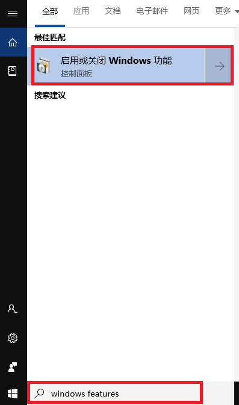
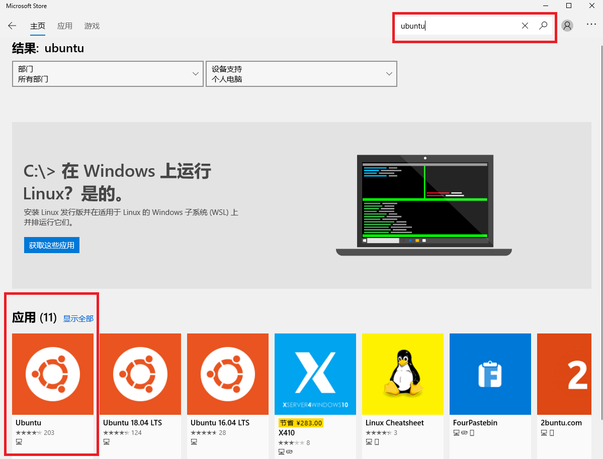

This Wiki helps you enable Windows Subsystem for Linux (WSL) in Windows 10.

## Enable Windows Developer Mode

1. Open the "Settings" app and navigate to the "Update & Security" category.

2. Choose "For developers" from the left sidebar and switch to "Developer mode".

3. Reboot Windows.

## Enable the WSL Windows Feature

1. Type "windows features" in the Search Box and then press Enter key.

2. In the popped up window, click "Windows Subsystem for Linux".

3. Reboot Windows.

## Install Ubuntu
1. Search "ubuntu" in Microsoft Store and click "ubuntu" to install it.

2. (Optional) If something went wrong, reset Microsoft Store and try it again.

2.1. Press the Win+R keys to open the Run dialog.

2.2. Type `wsreset.exe`, and click/tap on OK.

2.3. Open Microsoft Store again.

## Setting up Ubuntu

1. Open the Start menu, locate "Ubuntu", and click.

2. In the popped up command terminal, enter your username and password following the instructions.

3. Access Windows filesystem via `/mnt`
